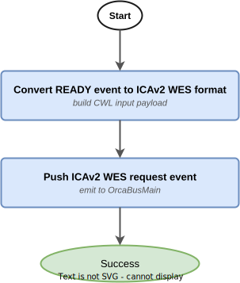

# Dragen WGTS DNA Pipeline Manager

- [Overview](#overview)
- [Pipeline Modes](#pipeline-modes)
- [Pipeline State Flow](#pipeline-state-flow)
  - [1. DRAFT → populated DRAFT](#1-draft--populated-draft)
  - [2. Populated DRAFT → READY](#2-populated-draft--ready)
  - [3. READY → ICAv2 submission](#3-ready--icav2-submission)
  - [4. ICAv2 state changes → WorkflowRunUpdate events](#4-icav2-state-changes--workflowrunupdate-events)
- [Event Contract](#event-contract)
  - [Consumed Events](#consumed-events)
  - [Published Events](#published-events)
- [Draft Event Payload](#draft-event-payload)
  - [Minimal DRAFT event detail](#minimal-draft-event-detail)
  - [Auto-populated Fields](#auto-populated-fields)
  - [Schema Validation](#schema-validation)
- [Submitting a Draft Event](#submitting-a-draft-event)
- [Infrastructure](#infrastructure)
  - [Stateful Resources](#stateful-resources)
  - [Stateless Resources](#stateless-resources)
  - [Stacks](#stacks)
- [CI/CD and Release Management](#cicd-and-release-management)
- [Related Services](#related-services)
- [SOPs](#sops)
- [Glossary & References](#glossary--references)

---

## Overview

This service manages the lifecycle of the **Dragen WGTS DNA pipeline** — Illumina's DRAGEN-based whole genome and transcriptome sequencing (WGTS) pipeline for DNA analysis (alignment + variant calling for germline and somatic data).

The pipeline runs on [ICAv2](https://help.dragen.illumina.com/product-guide/dragen-v4.4/dragen-dna-pipeline) via CWL. See the [CWL releases](https://github.com/umccr/cwl-ica/releases?q=dragen-wgts-dna&expanded=true) for versioned workflow definitions. Orchestration follows the standard [ICAv2-centric Pipeline Architecture](https://github.com/OrcaBus/wiki/blob/main/orcabus/platform/pipelines.md#pipeline-orchestration-general-logic).

**Upstream**: [Analysis Glue](https://github.com/OrcaBus/service-analysis-glue)
**Downstream**: [Oncoanalyser WGTS DNA](https://github.com/OrcaBus/service-oncoanalyser-wgts-dna-pipeline-manager), [Oncoanalyser WGTS DNA/RNA](https://github.com/OrcaBus/service-oncoanalyser-wgts-both-pipeline-manager)

---

## Pipeline Modes

The pipeline supports two invocation modes depending on how many libraries are provided in `linkedLibraries`:

| Mode | Libraries | What runs |
|---|---|---|
| **Germline-only** | 1 (normal/germline) | DRAGEN germline alignment + variant calling |
| **Somatic + Germline** | 2 (normal + tumor) | DRAGEN germline **and** somatic alignment + variant calling simultaneously |

The `tumorLibraryId` tag and all tumor-specific fields (`tumorSequenceData`, `somaticReference`, `tumorSampleName`, etc.) are only populated when a tumor library is present. The somatic default input parameters from SSM are similarly excluded in germline-only mode.

---

## Pipeline State Flow

The service orchestrates four Step Functions state machines that together drive a workflow run from initial DRAFT submission through to ICAv2 execution and result reporting.

### 1. DRAFT → populated DRAFT

**State machine**: [`populate_draft_data_sfn_template`](app/step-functions-templates/populate_draft_data_sfn_template.asl.json)


When a `WorkflowRunStateChange` DRAFT event arrives, this state machine populates any missing payload fields by resolving defaults from SSM and querying upstream services:

1. **Early exit check** — validates whether the existing `data` payload already satisfies the complete-data schema. If it does, no further population is needed and the state machine exits.
2. **Resolve engine parameters** (in parallel):
   - `projectId` — uses the provided value or fetches the environment default from SSM
   - `pipelineId` — uses the provided value, the event's `executionEnginePipelineId`, or looks up the default for the workflow version from SSM
   - `outputUri` — uses the provided value or builds a path from the SSM output prefix + `portalRunId`
   - `logsUri` — same pattern as `outputUri`
3. **Resolve tags** — compares library IDs in the draft tags against the `linkedLibraries` list. If they differ or are absent, fetches library metadata from the upstream service. Then in parallel:
   - `fastqRgidList` — fetched from Fastq Glue using `libraryId` if not already set
   - `tumorFastqRgidList` — fetched from Fastq Glue using `tumorLibraryId` if present; omitted entirely for germline-only runs
   - `subjectId` / `individualId` — fetched from the metadata service if not already present
4. **Emit a DRAFT update event** if tags or engine parameters changed (so the Workflow Manager record is kept in sync), then continue.
5. **Resolve readsets** — enriches each library in the libraries list with its OrcaBus fastq IDs (readsets), resolving from Fastq Glue if not already attached.
6. **Resolve inputs** (in parallel):
   - Normal `sequenceData` — if not already provided: resolves fastq IDs from `fastqRgidList` → emits a `FastqSync` task-token event waiting for fastqs to be QC'd, fingerprinted, and active → resolves the S3 URI prefix from the ICAv2 project → fetches FASTQ list rows.
   - Tumor `sequenceData` — identical flow driven by `tumorFastqRgidList`. **Skipped entirely for germline-only runs.**
   - Default input parameters — fetched from SSM for the workflow version. Somatic-specific defaults are **stripped** for germline-only runs.
7. **Resolve reference data** (in parallel):
   - `reference` (germline) — uses provided value or fetches the default for the workflow version from SSM
   - `somaticReference` — only resolved when `tumorLibraryId` is present; uses provided value or fetches SSM default
   - `oraReference` — only resolved when FASTQ files with `.ora` extension are detected in the sequence data
8. **Add QC tags** (in parallel):
   - Coverage estimate, duplication fraction, and insert size average for the normal library (`preLaunchCoverageEst`, `preLaunchDupFracEst`, `preLaunchInsertSizeEst`)
   - Same metrics for the tumor library — **skipped for germline-only runs**
   - NTSM internal concordance check for the normal library (`ntsmInternalPassing`)
   - NTSM internal concordance check for the tumor library — **skipped for germline-only runs**
   - NTSM external (tumor-normal) concordance check (`ntsmExternalPassing`) — **skipped for germline-only runs**
9. **Calculate downsampling** — only for somatic+germline runs; computes `somaticAlignmentOptions` downsampling ratios from coverage and duplication fraction estimates. **Skipped for germline-only runs.**
10. Emits a final DRAFT update event with the fully populated payload.

### 2. Populated DRAFT → READY

**State machine**: [`validate_draft_data_and_put_ready_event_sfn_template`](app/step-functions-templates/validate_draft_data_and_put_ready_event_sfn_template.asl.json)


Triggered when a DRAFT `WorkflowRunStateChange` event is received with a fully populated payload:

1. **Schema validation** — invokes the `validate_draft_complete_schema` Lambda against the registered AWS Schemas registry entry. On failure, a comment is written back to the workflow run record and the state machine exits silently.
2. **Post-schema validation** — invokes the `post_schema_validation` Lambda for business-rule checks beyond what JSON Schema can express (e.g. cross-field consistency, QC thresholds). On failure, same comment-and-exit behaviour.
3. **Push READY event** — emits a `WorkflowRunStateChange` READY event to the `OrcaBusMain` EventBridge bus.

### 3. READY → ICAv2 submission

**State machine**: [`ready_event_to_icav2_wes_request_event_sfn_template`](app/step-functions-templates/ready_event_to_icav2_wes_request_event_sfn_template.asl.json)



Converts a READY event into an `Icav2WesRequest` event that the [ICAv2 WES Manager](https://github.com/OrcaBus/service-icav2-wes-manager) consumes to launch the CWL analysis on ICAv2:

1. **Convert** — the `dragen_wgts_dna_ready_to_icav2_wes_request` Lambda translates the READY event payload into the ICAv2 WES request format.
2. **Push** — emits an `Icav2WesRequest` event to `OrcaBusMain`.

### 4. ICAv2 state changes → WorkflowRunUpdate events

**State machine**: [`icav2_wes_event_to_wrsc_event_sfn_template`](app/step-functions-templates/icav2_wes_event_to_wrsc_event_sfn_template.asl.json)


Listens for `Icav2WesAnalysisStateChange` events and converts them into `WorkflowRunUpdate` events:

1. **Convert** — the `convert_icav2_wes_state_change_event_to_wrsc_event` Lambda maps the ICAv2 status to a `WorkflowRunStateChange` event.
2. **Route by status**:
   - **SUCCEEDED** — adds post-analysis tags in parallel: germline variant calling output tags are always added; somatic variant calling output tags are added only when `tumorLibraryId` is present. Then pushes the WRSC event.
   - **FAILED** — invokes the `add_wes_failure_comment` Lambda to write a failure comment to the workflow run record, then pushes the WRSC event.
   - **Any other status** — pushes the WRSC event directly.

---

## Event Contract

### Consumed Events

| DetailType                    | Source                    | Schema                                                                                                                                     | Description                                          |
|-------------------------------|---------------------------|--------------------------------------------------------------------------------------------------------------------------------------------|------------------------------------------------------|
| `WorkflowRunStateChange`      | `orcabus.workflowmanager` | [WorkflowRunStateChange](https://github.com/OrcaBus/wiki/tree/main/orcabus-platform#workflowrunstatechange)                                | Carries DRAFT (and later READY) workflow run records |
| `Icav2WesAnalysisStateChange` | `orcabus.icav2wes`        | [Icav2WesAnalysisStateChange](https://github.com/OrcaBus/service-icav2-wes-manager/blob/main/app/event-schemas/analysis-state-change.json) | ICAv2 analysis state updates                         |

### Published Events

| DetailType          | Source                            | Schema                                                                                                      | Description                                         |
|---------------------|-----------------------------------|-------------------------------------------------------------------------------------------------------------|-----------------------------------------------------|
| `WorkflowRunUpdate` | `orcabus.dragenwgtsdna`           | [WorkflowRunUpdate](https://github.com/OrcaBus/wiki/blob/main/orcabus/platform/events.md#workflowrunupdate) | Pipeline state updates (READY, running, succeeded…) |
| `WorkflowRunUpdate` | `orcabus.dragenwgtsdna.validator` | same                                                                                                        | READY event specifically from the validator step    |

---

## Draft Event Payload

A DRAFT event can be submitted with a minimal `data` payload — the populate state machine resolves all defaults. The `data` object may be omitted entirely. The final validated payload must satisfy the [complete-data draft schema](app/event-schemas/complete-data-draft-schema.json).

The key driver is the `linkedLibraries` array on the event (not the payload `data`). This determines the pipeline mode:

- **Germline-only**: one entry (normal library)
- **Somatic + Germline**: two entries (normal + tumor library)

### Minimal DRAFT event detail

```json
{
  "status": "DRAFT",
  "workflowName": "dragen-wgts-dna",
  "workflowVersion": "4.4.4",
  "workflowRunName": "umccr--automated--dragen-wgts-dna--4-4-4--<portalRunId>",
  "portalRunId": "<portalRunId>",
  "linkedLibraries": [
    { "libraryId": "L2300950", "orcabusId": "lib.01..." }
  ]
}
```

For somatic + germline, add the tumor library to `linkedLibraries`:

```json
"linkedLibraries": [
  { "libraryId": "L2300950", "orcabusId": "lib.01..." },
  { "libraryId": "L2300943", "orcabusId": "lib.02..." }
]
```

The `payload.data` object may be included to override any auto-populated fields (see table below). An empty or absent `payload.data` is valid.

### Auto-populated Fields

All of the following are resolved by the populate state machine if not explicitly provided:

| Field | Resolved from | Germline-only | Somatic + Germline |
|---|---|:---:|:---:|
| `engineParameters.projectId` | SSM: default ICAv2 project for the environment | ✓ | ✓ |
| `engineParameters.pipelineId` | SSM: pipeline ID map keyed by workflow version | ✓ | ✓ |
| `engineParameters.outputUri` | SSM: output prefix + `portalRunId` | ✓ | ✓ |
| `engineParameters.logsUri` | SSM: logs prefix + `portalRunId` | ✓ | ✓ |
| `tags.libraryId` | From `linkedLibraries` (first/normal entry) | ✓ | ✓ |
| `tags.tumorLibraryId` | From `linkedLibraries` (second/tumor entry) | — | ✓ |
| `tags.fastqRgidList` | Fastq Glue — resolved from `libraryId` | ✓ | ✓ |
| `tags.tumorFastqRgidList` | Fastq Glue — resolved from `tumorLibraryId` | — | ✓ |
| `tags.subjectId` / `individualId` | Metadata service | ✓ | ✓ |
| `tags.preLaunchCoverageEst` etc. | QC stats from Fastq Glue (normal library) | ✓ | ✓ |
| `tags.tumorPreLaunchCoverageEst` etc. | QC stats from Fastq Glue (tumor library) | — | ✓ |
| `tags.ntsmInternalPassing` | NTSM concordance check (normal library) | ✓ | ✓ |
| `tags.tumorNtsmInternalPassing` | NTSM concordance check (tumor library) | — | ✓ |
| `tags.ntsmExternalPassing` | NTSM tumor-normal concordance check | — | ✓ |
| `inputs.sampleName` | Derived from `libraryId` tag | ✓ | ✓ |
| `inputs.tumorSampleName` | Derived from `tumorLibraryId` tag | — | ✓ |
| `inputs.sequenceData` | Fastq Glue — FASTQ list rows for normal library | ✓ | ✓ |
| `inputs.tumorSequenceData` | Fastq Glue — FASTQ list rows for tumor library | — | ✓ |
| `inputs.reference` | SSM: default germline reference for workflow version | ✓ | ✓ |
| `inputs.somaticReference` | SSM: default somatic reference for workflow version | — | ✓ |
| `inputs.oraReference` | SSM: default ORA reference (only when `.ora` FASTQs detected) | ✓ | ✓ |
| `inputs.somaticAlignmentOptions` | Calculated downsampling ratios from QC estimates | — | ✓ |

### Schema Validation

The complete-data schema is registered in the AWS Schemas registry and used for validation in both state machines. You can interactively validate a payload at:

- [JSON Schema Validator — Complete DRAFT data](https://www.jsonschemavalidator.net/s/JX96lXfY)

---

## Submitting a Draft Event

To manually submit a Dragen WGTS DNA DRAFT event (e.g. to trigger a reanalysis), follow:

- [PM.DWD.1 — Manual Pipeline Execution](docs/operation/SOP/PM.DWD.1/PM.DWD.1-ManualPipelineExecution.md)

See the [full SOPs index](docs/operation/SOP/README.md) for all operational procedures including deployment, parameter updates, and troubleshooting.

---

## Infrastructure

The service is deployed via AWS CDK. Resources are split into two stacks: stateful (data/config) and stateless (compute/events).

All SSM parameters live under `/orcabus/workflows/dragen-wgts-dna/`.
Event bus: `OrcaBusMain`
Event source: `orcabus.dragenwgtsdna`

### Stateful Resources

**AWS Schemas registry**
- `dragen-wgts-dna-complete-data-draft-schema.json` — used to validate DRAFT payloads before promotion to READY

**SSM Parameters**

| Parameter | Description |
|---|---|
| `workflowName` | `dragen-wgts-dna` |
| `workflowVersion` | Current default version (e.g. `4.4.4`) |
| `payloadVersion` | Payload schema version |
| `icav2ProjectId` | Default ICAv2 project ID per environment |
| `logsPrefix` | Default S3 prefix for logs |
| `outputPrefix` | Default S3 prefix for outputs |
| `pipelineIdsByWorkflowVersion/<version>` | ICAv2 CWL pipeline ID for each workflow version |
| `inputsByWorkflowVersion/<version>` | Default input overrides per workflow version |
| `referenceByWorkflowVersion/<version>` | Default germline reference tarball path |
| `somaticReferenceByWorkflowVersion/<version>` | Default somatic reference tarball path |
| `oraReferenceVersionPath` | Default ORA reference version path |

### Stateless Resources

- **Lambda functions** (Python 3.14, ARM64) — one per task in the state machines; see [`app/lambdas/`](app/lambdas/)
- **Step Functions state machines** — four ASL templates in [`app/step-functions-templates/`](app/step-functions-templates/)
- **EventBridge rules** — route incoming `WorkflowRunStateChange` (DRAFT) and `Icav2WesAnalysisStateChange` events to the appropriate state machines

### Stacks

The CDK project deploys a CodePipeline in the toolchain account that promotes changes to `beta`, `gamma`, and `prod`.

```sh
# List stateful stacks
pnpm cdk-stateful ls
# StatefulDragenWgtsDnaPipeline
# StatefulDragenWgtsDnaPipeline/.../OrcaBusBeta/StatefulDragenWgtsDnaPipeline
# StatefulDragenWgtsDnaPipeline/.../OrcaBusGamma/StatefulDragenWgtsDnaPipeline
# StatefulDragenWgtsDnaPipeline/.../OrcaBusProd/StatefulDragenWgtsDnaPipeline

# List stateless stacks
pnpm cdk-stateless ls
# StatelessDragenWgtsDnaPipelineManager
# StatelessDragenWgtsDnaPipelineManager/.../OrcaBusBeta/StatelessDragenWgtsDnaPipelineManager
# StatelessDragenWgtsDnaPipelineManager/.../OrcaBusGamma/StatelessDragenWgtsDnaPipelineManager
# StatelessDragenWgtsDnaPipelineManager/.../OrcaBusProd/StatelessDragenWgtsDnaPipelineManager
```

---

## CI/CD and Release Management

All changes merged to `main` are automatically built and deployed to `beta` and `gamma`. Promotion to `prod` requires manually enabling the CodePipeline transition in the AWS console.

---

## Related Services

| Role            | Service                                                                                                 |
|-----------------|---------------------------------------------------------------------------------------------------------|
| Upstream        | [Analysis Glue](https://github.com/OrcaBus/service-analysis-glue)                                       |
| Downstream      | [Oncoanalyser WGTS DNA](https://github.com/OrcaBus/service-oncoanalyser-wgts-dna-pipeline-manager)      |
| Downstream      | [Oncoanalyser WGTS DNA/RNA](https://github.com/OrcaBus/service-oncoanalyser-wgts-both-pipeline-manager) |
| Downstream      | [Sash](https://github.com/OrcaBus/service-sash-pipeline-manager)                                        |
| ICAv2 execution | [ICAv2 WES Manager](https://github.com/OrcaBus/service-icav2-wes-manager)                               |
| Workflow state  | [Workflow Manager](https://github.com/OrcaBus/service-workflow-manager)                                 |
| Fastq           | [Fastq Glue](https://github.com/OrcaBus/service-fastq-glue)                                             |

---

## SOPs

| SOP | Description |
|---|---|
| [PM.DWD.1](docs/operation/SOP/PM.DWD.1/PM.DWD.1-ManualPipelineExecution.md) | Manually kick off a reanalysis |
| [PM.DWD.2](docs/operation/SOP/PM.DWD.2/PM.DWD.2-NewDragenWgtsDnaPipelineDeployment.md) | Install and deploy a new pipeline version |
| [PM.DWD.3](docs/operation/SOP/PM.DWD.3/PM.DWD.3-UpdatingPipelineParameters.md) | Update SSM parameters |
| [PM.DWD.4](docs/operation/SOP/PM.DWD.4/PM.DWD.4-RunningWorkflowValidations.md) | Run workflow validations |
| [PM.DWD.5](docs/operation/SOP/PM.DWD.5/PM.DWD.5-TroubleShooting.md) | Troubleshoot common issues |

---

## Glossary & References

- Platform glossary: [OrcaBus wiki](https://github.com/OrcaBus/wiki/blob/main/orcabus-platform/README.md#glossary--references)
- For development setup, build commands, project structure, and conventions see the [steering docs](.kiro/steering/).
